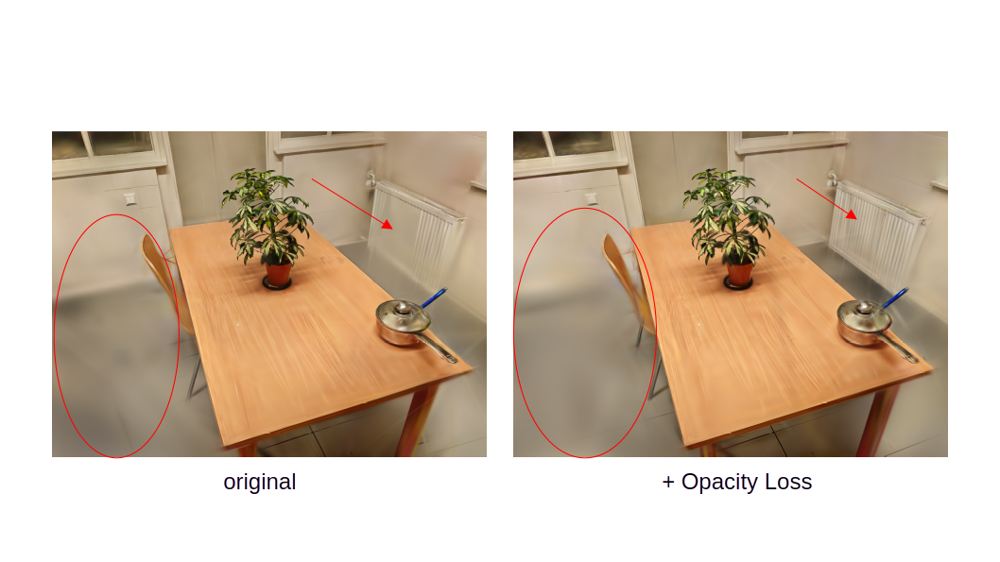
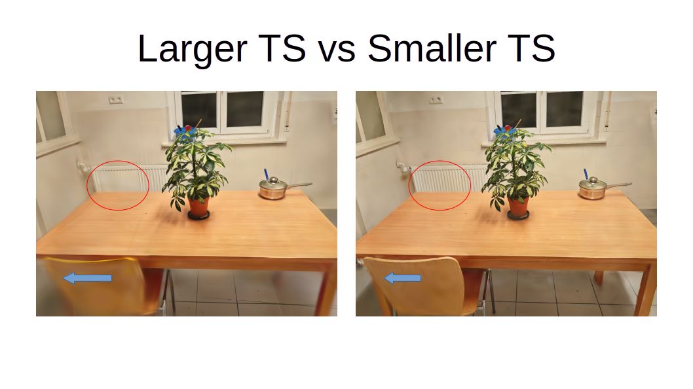
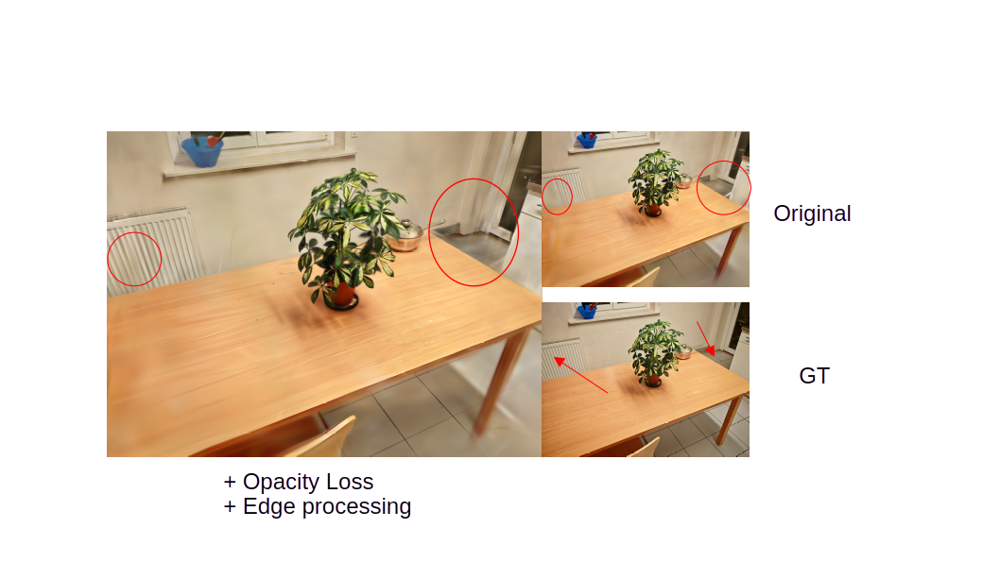
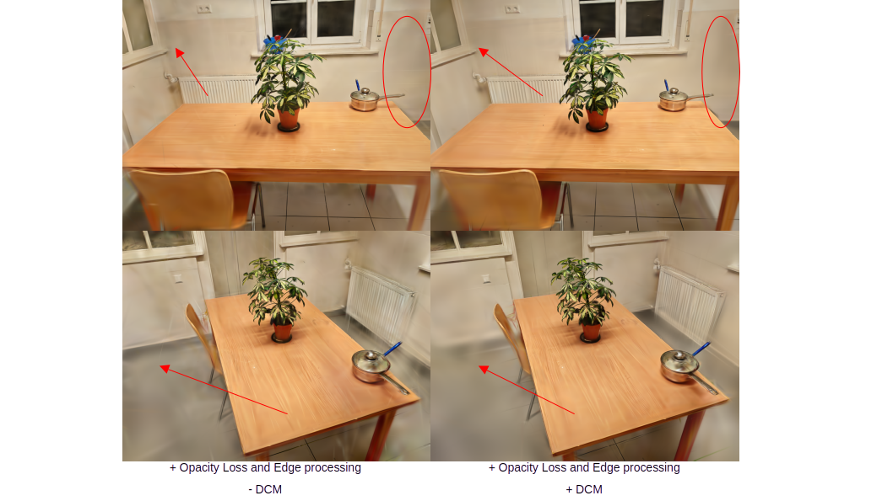

## 0. 说明

本报告记录了在学习与实验 3D Gaussian Splatting（3DGS）及 NeRF 系方法过程中所进行的一系列实验与工程尝试。

报告内容按照**实际实验推进顺序**组织，而非论文式结构。其中包含成功实验、失败案例以及最终被放弃的方向。部分实验并未得到理想结果，但仍被完整保留，以反映真实的工程与研究过程。

本报告的重点在于：
- 实验是如何进行的；
- 各类修改带来了怎样的实际效果；
- 哪些问题可以缓解，哪些问题属于方法本身的边界。

## 1. 实验起点：官方 3DGS 与 NeRF 的复现

所有后续实验均建立在官方实现正确复现的基础之上。

首先复现了官方 3D Gaussian Splatting（3DGS）代码，包括：
- 在官方示例数据集上的训练与渲染；
- 验证训练过程与渲染结果是否与官方展示一致；
- 检查不同随机种子与分辨率设置下的稳定性。

同时，为后续对比实验准备了 NeRF 系方法的运行环境，并成功复现了 Instant-NGP 在示例数据集上的基本结果。

该阶段的目的并非性能优化，而是：
- 确认环境与代码行为正确；
- 建立所有后续实验的基线参照。

## 2. 自定义数据实验

在完成官方 3DGS 与 NeRF 基线复现后，实验重点转向自定义数据。该阶段的目标并非追求视觉效果，而是观察 3DGS 在非理想条件下的实际行为，并分析其失效原因。

实验过程经历了仿真数据与真实数据的多轮尝试，其中多次实验结果不理想，但为后续判断方法边界提供了重要依据。

### 2.1 仿真数据实验（失败案例）

最初尝试在仿真环境中构建室内场景，并生成用于 3DGS 训练的图像数据。仿真场景包括：

- 简单几何体与方块组成的室内结构；
- 包含机器人模型与基础室内布局的场景；
- 预定义的相机轨迹与视角分布。

仿真数据的优势在于几何与位姿完全可控，但实验中暴露出以下关键问题：

- 大量区域为纯色或弱纹理表面；
- COLMAP 特征点提取数量极少且分布不稳定；
- 相机位姿估计质量较差；
- 稀疏点云在平面区域严重退化。

在该条件下，3DGS 初始化阶段即受到严重影响，训练结果高度不稳定，部分实验无法正常收敛。

基于以上观察，判断当前仿真配置并不适合作为基于 SfM 的 3DGS 输入，仿真数据实验在该阶段被中止。

### 2.2 第一版真实数据集（效果较差）

在仿真实验失败后，转向真实室内环境进行数据采集。第一版真实数据集由手持相机拍摄，覆盖典型室内空间。

在该数据集上：

- COLMAP 可以完成相机位姿估计；
- 3DGS 能够正常初始化并进入训练流程；
- 但最终重建结果在视觉上存在明显问题。

主要表现为：

- 墙面与地板等大面积背景区域严重模糊；
- 墙角、墙-地交界处边界不清晰；
- 背景区域出现明显的颜色漂移与不稳定现象；
- 主体目标出现重建结构错乱，重影不稳定等现象。

该数据集并未被丢弃，而是作为后续分析的失败案例，用于判断问题是否来自数据采集本身或模型表示能力。

### 2.3 改进后的真实数据集

基于第一版真实数据集的实验结果，对数据采集策略进行了调整，包括：

- 增加相机视角变化与空间覆盖范围；
- 优化拍摄路径，减少视角集中；
- 尽量避免过曝与明显模糊帧。

在改进后的真实数据集上，COLMAP 重建质量明显提升，3DGS 训练过程更加稳定，模型能够可靠收敛。

然而，即便在改进数据条件下，以下问题仍然存在：

- 纯色背景区域仍然缺乏清晰结构；
- 平面区域细节难以恢复；
- 边界区域依旧容易受到高斯漂移影响。

这一阶段的实验表明，数据质量的提升可以改善稳定性，但无法从根本上解决室内场景中的背景与边界问题。

## 3. 数据处理与工程细节记录

在所有自定义数据实验中，对数据处理流程进行了显式检查与调整，主要包括：

- COLMAP 特征提取与匹配参数；
- 相机位姿与尺度一致性；
- 图像分辨率与裁剪策略；
- 训练与测试相机划分。

实验过程中反复验证了一个结论：  
3DGS 对输入的 SfM 结果高度敏感，其表现无法脱离数据处理质量单独评估。

## 4. 原始 3DGS Pipeline 的修改实验

在 baseline 能够稳定运行的前提下，开始对原始 3DGS pipeline 进行一系列工程级修改尝试，重点关注背景与边界相关问题。

### 4.1 透明度 / Opacity 修改

首先尝试通过调整透明度相关参数或引入额外约束，缓解背景区域中高斯不稳定的问题。

实验表明：

- 适度的透明度约束可以减少背景区域的漂移；
- 但过强的约束会抑制高斯表达能力，导致整体细节损失。

该类修改只能在有限程度上改善背景稳定性，无法解决纯色区域缺乏结构的问题。



### 4.2 Densification 阈值实验

对 densification 与 pruning 相关阈值进行了系统性测试，包括：

- 不同 densification 梯度阈值；
- 不同 densification 触发频率；
- 早期与后期 densification 行为对比。

实验观察到明显的权衡关系：

- 激进 densification 有助于强化边界，但会引入噪声与伪影；
- 保守策略使画面更干净，但边界模糊问题更加明显。

该实验进一步表明，阈值调节本身无法从根本上解决结构缺失问题。



### 4.3 边界与背景定向处理

针对室内场景中的典型结构（如墙角、平面交界），尝试对背景与边界区域施加定向处理策略。

实验结果显示：

- 几何边界的清晰度有所提升；
- 但在背景区域引入了类似阴影的视觉伪影；
- 表明几何约束与外观一致性之间存在明显冲突。

该阶段实验明确了边界增强方法的收益与代价。



## 5. Diffusion / Residual 实验分支（DCM）

在上述修改均未能从根本上解决背景与边界问题的情况下，尝试引入基于 diffusion 的生成模型作为辅助。

最初的设想是引入完整的扩散生成模型，对 3DGS 输出结果进行增强。然而实验发现：

- 完整 diffusion 模型只能作为后处理手段；
- 其作用主要体现在对已完成渲染图像的视觉美化；
- 无法对 3DGS 的几何建模与训练过程本身提供有效帮助。

因此，该方向被否定。

在此基础上，实验策略发生调整：不再使用完整扩散生成模型，而是改为训练一个 **Detail Completion Model（DCM）**，专注于学习 3DGS 渲染结果与真实图像之间的 residual。

DCM 的作用不是生成完整图像，而是：
- 提供缺失的结构细节；
- 在 3DGS 训练阶段注入额外监督；
- 为纯色与边界区域提供更强梯度信号。

该实验分支被视为一种工程级增强尝试，而非核心方法。



## 6. 与 NeRF / Instant-NGP 的对比实验

在相同数据集条件下，对 3DGS 与 Instant-NGP 进行了对比实验。

实验观察到：

- NeRF 系方法在连续纹理建模方面具有优势；
- 3DGS 在边界清晰度与渲染效率上表现更好；
- 对于重复、平坦的纹理区域，两类方法均存在明显局限。
- 对于较低质量的数据集，在重建的时候NeRF存在更多的“漂浮物”

该对比进一步表明，不同方法的表现差异源于表示方式本身，而非单一实现细节。

## 7. 实验现象总结与失败模式归纳

综合所有实验，可以归纳出以下典型现象：

- 纯色与弱纹理平面是 3DGS 的主要不稳定来源；
- 边界增强会引入新的视觉伪影；
- diffusion/DCM 可改善感知质量，但不等价于结构恢复；
- 数据质量提升只能部分缓解问题。

这些现象在多个实验设置下反复出现，具有一致性。

## 8. 方法边界与停止决策说明

在完成上述实验后，认为当前方法已接近其工程可行边界。

继续投入复杂模型或更大规模生成模型，预计只能带来有限收益，而无法解决核心结构缺失问题。因此，本项目在该阶段选择收束实验范围，并转向总结与复盘。

## 9. 硬件条件与 OOM 约束

所有实验均在单台消费级设备上完成：

- GPU：NVIDIA RTX 4060（8GB，Laptop）
- 内存：32GB
- 操作系统：Ubuntu Linux

受限于显存容量，多次实验采用了受限配置，例如：

```bash
python train_changed.py \
  --iterations 30000 \
  --densify_until_iter 7000 \
  --densify_grad_threshold 0.0008 \
  --densification_interval 200 \
  --data_device cpu
```
## 10. 总结

本报告记录了一条从方法复现、失败分析到工程改进与边界确认的完整实验路径。实验表明，3DGS 在室内场景中具有明显优势，但同时也存在难以通过简单工程手段解决的结构性瓶颈。

理解这些边界，被视为本项目的重要收获。

参考论文
[1] Kerbl et al., "3D Gaussian Splatting for Real-Time Radiance Field Rendering", SIGGRAPH 2023.
[2] Mildenhall et al., "NeRF: Representing Scenes as Neural Radiance Fields", ECCV 2020.